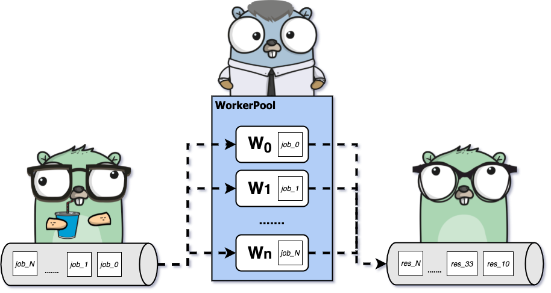

# WHAT WE'LL COVER
- The Worker Pool
- Units of work are distributed among a pool of workers which run concurrently.
- Communication is done through channels
- Useful for long-running or processor intensive (involving a lot of effort) tasks

# WORKER POOL

- A worker pool is a collection of threads that are waiting for work.
- When work becomes available, it is assigned to one of the threads in the pool.
- The main advantage of a worker pool is that it allows you to control the number of threads that are running at any given time.
- This is important because creating and managing threads can be expensive.
- By using a worker pool, you can limit the number of threads that are created and running at any given time.
- This can help to improve the performance of your application.
- The worker pool pattern is commonly used in server applications where you need to handle multiple requests concurrently.
- It is also useful in other situations where you need to perform a large number of tasks concurrently.

$$
\frac{\partial f}{\partial t}
$$